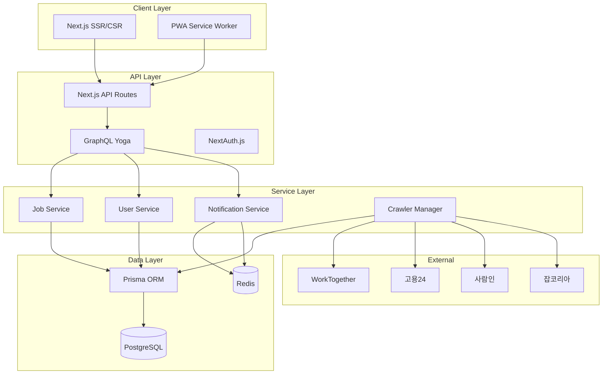

# 📐 기술 요구사항 문서 (TRD)

## 1. 문서 개요

- **제품명:** ReBridge
- **작성일:** 2025-07-12
- **버전:** 1.0 (MVP)
- **목적:** PRD에 정의된 MVP 기능을 구현하기 위한 상세 기술 명세 및 구현 가이드

---

## 2. 기술 스택 상세

### 2.1 핵심 기술 스택

|계층|기술|버전|선택 이유|
|---|---|---|---|
|**Frontend**|Next.js|14.2.x|App Router, RSC, SEO 최적화|
|**Backend**|Next.js API Routes|14.2.x|단일 코드베이스, Edge Runtime 지원|
|**Database**|PostgreSQL (Neon)|16|Serverless, 자동 스케일링, 한국어 전문검색|
|**Cache/Queue**|Upstash Redis|Latest|Serverless Redis, 낮은 레이턴시|
|**ORM**|Prisma|5.x|타입 안전성, 마이그레이션 관리|
|**크롤링**|Puppeteer/Playwright|Latest|동적 사이트 처리, 안정성|
|**인증**|NextAuth.js|5.x|다양한 Provider 지원|
|**모노레포**|pnpm + Turborepo|Latest|빠른 빌드, 효율적 캐싱|

### 2.2 개발 도구

```json
{
  "typescript": "^5.3",
  "eslint": "^8.57",
  "prettier": "^3.2",
  "vitest": "^1.2",
  "playwright": "^1.41"
}
```

---

## 3. 시스템 아키텍처 상세

### 3.1 전체 아키텍처



### 3.2 데이터 흐름

```typescript
// 크롤링 → 저장 → 캐싱 → 제공
interface DataFlow {
  1. "크롤러가 외부 사이트에서 데이터 수집"
  2. "어댑터가 데이터 정규화"
  3. "Prisma로 PostgreSQL 저장"
  4. "Redis에 최신 데이터 캐싱"
  5. "API가 캐시 우선 조회 후 응답"
}
```

---

## 4. API 설계

### 4.1 GraphQL 스키마

```graphql
type Query {
  # 채용 공고 조회
  jobs(
    page: Int = 1
    limit: Int = 20
    search: String
    filters: JobFilterInput
  ): JobConnection!
  
  # 단일 공고 상세
  job(id: ID!): Job
  
  # 내 저장 공고
  savedJobs(page: Int = 1, limit: Int = 20): JobConnection!
  
  # 현재 사용자 정보
  me: User
}

type Mutation {
  # 인증
  signUp(input: SignUpInput!): AuthPayload!
  signIn(input: SignInInput!): AuthPayload!
  signOut: Boolean!
  
  # 공고 저장/삭제
  saveJob(jobId: ID!): Job!
  unsaveJob(jobId: ID!): Boolean!
  
  # 프로필 업데이트
  updateProfile(input: UpdateProfileInput!): User!
}

type Subscription {
  # 새 공고 알림
  newJobs(filters: JobFilterInput): Job!
}

# 타입 정의
type Job {
  id: ID!
  source: JobSource!
  externalId: String!
  title: String!
  company: String
  location: Location
  salaryRange: SalaryRange
  employmentType: String
  description: String!
  isDisabilityFriendly: Boolean!
  crawledAt: DateTime!
  expiresAt: DateTime
  isSaved: Boolean!
}

type JobConnection {
  edges: [JobEdge!]!
  pageInfo: PageInfo!
  totalCount: Int!
}

input JobFilterInput {
  sources: [JobSource!]
  isDisabilityFriendly: Boolean
  employmentTypes: [String!]
  locationIds: [String!]
}

enum JobSource {
  WORK_TOGETHER
  WORK24
  SARAMIN
  JOBKOREA
}
```

### 4.2 REST API 엔드포인트

```typescript
// Health Check
GET /api/health

// 크롤러 Webhook
POST /api/crawler/trigger
{
  "source": "workTogether",
  "secret": "CRAWLER_SECRET"
}

// 파일 업로드 (이력서 등)
POST /api/upload
Content-Type: multipart/form-data
```

---

## 5. 데이터베이스 설계

### 5.1 Prisma 스키마

```prisma
// prisma/schema.prisma
generator client {
  provider = "prisma-client-js"
  previewFeatures = ["fullTextSearch", "postgresqlExtensions"]
}

datasource db {
  provider = "postgresql"
  url = env("DATABASE_URL")
  extensions = [pgcrypto, pg_trgm]
}

model User {
  id                      String    @id @default(dbgenerated("gen_random_uuid()"))
  email                   String    @unique
  passwordHash            String    @map("password_hash")
  isRegisteredDisability  Boolean   @default(false) @map("is_registered_disability")
  createdAt               DateTime  @default(now()) @map("created_at")
  updatedAt               DateTime  @updatedAt @map("updated_at")
  
  profile                 Profile?
  savedJobs              SavedJob[]
  notifications          Notification[]
  
  @@map("users")
}

model Profile {
  userId          String   @id @map("user_id")
  name            String?
  phoneNumber     String?  @map("phone_number")
  preferredAreas  Json?    @map("preferred_areas")
  emailAlerts     Boolean  @default(true) @map("email_alerts")
  pushAlerts      Boolean  @default(false) @map("push_alerts")
  
  user            User     @relation(fields: [userId], references: [id], onDelete: Cascade)
  
  @@map("profiles")
}

model Job {
  id                    String    @id @default(dbgenerated("gen_random_uuid()"))
  source               String
  externalId           String    @map("external_id")
  title                String
  company              String?
  locationJson         Json?     @map("location_json")
  salaryRange          Json?     @map("salary_range")
  employmentType       String?   @map("employment_type")
  description          String    @db.Text
  isDisabilityFriendly Boolean   @default(false) @map("is_disability_friendly")
  crawledAt            DateTime  @map("crawled_at")
  expiresAt            DateTime? @map("expires_at")
  rawData              Json      @map("raw_data")
  
  savedBy              SavedJob[]
  
  @@unique([source, externalId])
  @@index([crawledAt(sort: Desc)])
  @@index([company, title])
  @@map("jobs")
}

model SavedJob {
  userId    String   @map("user_id")
  jobId     String   @map("job_id")
  savedAt   DateTime @default(now()) @map("saved_at")
  
  user      User     @relation(fields: [userId], references: [id], onDelete: Cascade)
  job       Job      @relation(fields: [jobId], references: [id], onDelete: Cascade)
  
  @@id([userId, jobId])
  @@map("user_saved_jobs")
}

model CrawlLog {
  id            String    @id @default(dbgenerated("gen_random_uuid()"))
  source        String
  status        String
  jobsFound     Int       @map("jobs_found")
  jobsNew       Int       @map("jobs_new")
  jobsUpdated   Int       @map("jobs_updated")
  errorMessage  String?   @map("error_message")
  startedAt     DateTime  @map("started_at")
  completedAt   DateTime? @map("completed_at")
  
  @@index([startedAt(sort: Desc)])
  @@map("crawl_logs")
}

model Notification {
  id        String   @id @default(dbgenerated("gen_random_uuid()"))
  userId    String   @map("user_id")
  type      String
  payload   Json
  isRead    Boolean  @default(false) @map("is_read")
  createdAt DateTime @default(now()) @map("created_at")
  
  user      User     @relation(fields: [userId], references: [id], onDelete: Cascade)
  
  @@index([userId, isRead])
  @@map("notifications")
}
```

### 5.2 마이그레이션 전략

```bash
# 초기 마이그레이션
pnpm prisma migrate dev --name init

# 전문검색 인덱스 추가
pnpm prisma migrate dev --name add_fulltext_search

# 프로덕션 배포
pnpm prisma migrate deploy
```

---

## 6. 크롤러 구현 상세

### 6.1 크롤러 인터페이스

```typescript
// packages/crawler-adapters/src/types.ts
export interface RawJobData {
  id: string;
  title: string;
  company?: string;
  location?: string;
  salary?: string;
  type?: string;
  description?: string;
  postedAt?: string;
  deadline?: string;
  url: string;
  raw: Record<string, unknown>;
}

export interface NormalizedJob {
  externalId: string;
  title: string;
  company: string | null;
  locationJson: {
    city?: string;
    district?: string;
    address?: string;
  } | null;
  salaryRange: {
    min?: number;
    max?: number;
    type?: 'monthly' | 'yearly';
  } | null;
  employmentType: string | null;
  description: string;
  isDisabilityFriendly: boolean;
  expiresAt: Date | null;
  rawData: Record<string, unknown>;
}

export abstract class BaseCrawler implements CrawlerAdapter {
  abstract source: JobSource;
  protected page: Page | null = null;
  
  abstract crawl(pageNum?: number): Promise<RawJobData[]>;
  abstract parseJobDetail(id: string): Promise<JobDetail>;
  abstract normalizeData(raw: RawJobData): NormalizedJob;
  
  protected async initBrowser(): Promise<void> {
    const browser = await chromium.launch({
      headless: true,
      args: ['--no-sandbox', '--disable-setuid-sandbox']
    });
    this.page = await browser.newPage();
    await this.page.setViewportSize({ width: 1920, height: 1080 });
  }
  
  protected async delay(ms: number): Promise<void> {
    await new Promise(resolve => setTimeout(resolve, ms));
  }
}
```

### 6.2 크롤러 스케줄링

```typescript
// apps/crawler/src/scheduler.ts
import { CronJob } from 'cron';
import { Queue } from 'bullmq';

const crawlQueue = new Queue('crawl-jobs', {
  connection: redis
});

// 6시간마다 실행
const job = new CronJob('0 */6 * * *', async () => {
  const sources = ['workTogether', 'work24', 'saramin', 'jobkorea'];
  
  for (const source of sources) {
    await crawlQueue.add('crawl', { 
      source,
      timestamp: new Date().toISOString()
    }, {
      attempts: 3,
      backoff: {
        type: 'exponential',
        delay: 2000
      }
    });
  }
});

job.start();
```

---

## 7. 보안 요구사항

### 7.1 인증 및 권한

```typescript
// lib/auth.ts
export const authOptions: NextAuthOptions = {
  providers: [
    CredentialsProvider({
      credentials: {
        email: { type: "email" },
        password: { type: "password" }
      },
      async authorize(credentials) {
        const user = await prisma.user.findUnique({
          where: { email: credentials.email }
        });
        
        if (!user) return null;
        
        const isValid = await bcrypt.compare(
          credentials.password,
          user.passwordHash
        );
        
        if (!isValid) return null;
        
        return {
          id: user.id,
          email: user.email
        };
      }
    }),
    KakaoProvider({
      clientId: process.env.KAKAO_CLIENT_ID!,
      clientSecret: process.env.KAKAO_CLIENT_SECRET!
    })
  ],
  session: {
    strategy: 'jwt',
    maxAge: 30 * 24 * 60 * 60 // 30일
  },
  jwt: {
    secret: process.env.JWT_SECRET!
  }
};
```

### 7.2 보안 미들웨어

```typescript
// middleware.ts
export const config = {
  matcher: ['/api/:path*', '/profile/:path*']
};

export function middleware(request: NextRequest) {
  // CSRF 토큰 검증
  const token = request.headers.get('x-csrf-token');
  if (!token || !verifyCSRFToken(token)) {
    return new Response('Invalid CSRF token', { status: 403 });
  }
  
  // Rate Limiting
  const ip = request.ip ?? 'unknown';
  const identifier = `${ip}:${request.url}`;
  
  // API 레이트 리밋: 분당 60회
  if (isRateLimited(identifier, 60, 60)) {
    return new Response('Too Many Requests', { status: 429 });
  }
  
  return NextResponse.next();
}
```

---

## 8. 성능 요구사항

### 8.1 성능 목표

|메트릭|목표값|측정 방법|
|---|---|---|
|**페이지 로드**|< 2초 (LCP)|Lighthouse|
|**API 응답**|< 200ms (p95)|Grafana|
|**크롤링 주기**|6시간|CronJob|
|**DB 쿼리**|< 50ms (p95)|Prisma Metrics|
|**동시 사용자**|1,000명|K6 부하테스트|

### 8.2 최적화 전략

```typescript
// 캐싱 전략
const cacheStrategy = {
  jobs: {
    list: 3600,      // 1시간
    detail: 7200,    // 2시간
    search: 1800     // 30분
  },
  user: {
    profile: 300,    // 5분
    savedJobs: 60    // 1분
  }
};

// 데이터베이스 쿼리 최적화
const optimizedJobQuery = prisma.$queryRaw`
  SELECT j.*, 
         EXISTS(SELECT 1 FROM user_saved_jobs WHERE job_id = j.id AND user_id = ${userId}) as is_saved
  FROM jobs j
  WHERE j.crawled_at > NOW() - INTERVAL '7 days'
  ORDER BY j.crawled_at DESC
  LIMIT 20 OFFSET ${offset}
`;
```

---

## 9. 배포 및 인프라

### 9.1 배포 파이프라인

```yaml
# .github/workflows/deploy.yml
name: Deploy
on:
  push:
    branches: [main]

jobs:
  deploy:
    runs-on: ubuntu-latest
    steps:
      - uses: actions/checkout@v4
      - uses: pnpm/action-setup@v2
      - uses: actions/setup-node@v4
        with:
          node-version: '20'
          cache: 'pnpm'
      
      - run: pnpm install --frozen-lockfile
      - run: pnpm test
      - run: pnpm build
      
      - name: Deploy to Vercel
        run: vercel --prod
        env:
          VERCEL_TOKEN: ${{ secrets.VERCEL_TOKEN }}
```

### 9.2 환경 변수

```env
# .env.production
DATABASE_URL=
REDIS_URL=
NEXTAUTH_URL=
NEXTAUTH_SECRET=
JWT_SECRET=
KAKAO_CLIENT_ID=
KAKAO_CLIENT_SECRET=
CRAWLER_SECRET=
RESEND_API_KEY=
SENTRY_DSN=
```

---

## 10. 모니터링 및 로깅

### 10.1 로깅 전략

```typescript
// lib/logger.ts
import pino from 'pino';

export const logger = pino({
  level: process.env.LOG_LEVEL || 'info',
  transport: {
    target: 'pino-pretty',
    options: {
      colorize: true
    }
  }
});

// 크롤링 로그
logger.info({
  type: 'crawl_completed',
  source: 'workTogether',
  jobsFound: 150,
  jobsNew: 23,
  duration: 45000
});
```

### 10.2 모니터링 대시보드

```typescript
// 주요 메트릭
interface Metrics {
  // 크롤링
  crawlSuccessRate: number;
  avgCrawlDuration: number;
  totalJobsCrawled: number;
  
  // API
  apiRequestRate: number;
  apiErrorRate: number;
  apiResponseTime: number;
  
  // 사용자
  activeUsers: number;
  newSignups: number;
  savedJobsCount: number;
}
```

---

## 11. 테스트 전략

### 11.1 테스트 구조

```typescript
// 단위 테스트 예시
describe('JobNormalizer', () => {
  it('should normalize salary range correctly', () => {
    const raw = { salary: '300-400만원' };
    const normalized = normalizer.normalizeSalary(raw);
    
    expect(normalized).toEqual({
      min: 3000000,
      max: 4000000,
      type: 'monthly'
    });
  });
});

// E2E 테스트
test('user can save and view jobs', async ({ page }) => {
  await page.goto('/jobs');
  await page.click('[data-testid="job-save-button"]');
  await page.goto('/saved-jobs');
  
  await expect(page.locator('[data-testid="saved-job-item"]')).toBeVisible();
});
```

---

## 12. 기술적 위험 및 대응

|위험 요소|영향도|대응 방안|
|---|---|---|
|**크롤링 차단**|높음|User-Agent 로테이션, 프록시 준비|
|**데이터 정규화 실패**|중간|원본 데이터 보존, 수동 검수|
|**트래픽 급증**|중간|Auto-scaling, CDN 활용|
|**보안 취약점**|높음|정기 보안 감사, OWASP 체크|

---

## 13. 개발 규칙

### 13.1 코드 스타일

```typescript
// ESLint 설정
{
  "extends": ["next/core-web-vitals", "prettier"],
  "rules": {
    "no-console": ["error", { "allow": ["warn", "error"] }],
    "@typescript-eslint/explicit-function-return-type": "error"
  }
}
```

### 13.2 커밋 규칙

```bash
# Conventional Commits
feat: 새로운 기능
fix: 버그 수정
docs: 문서 수정
style: 코드 포맷팅
refactor: 코드 리팩토링
test: 테스트 추가/수정
chore: 빌드/설정 수정
```

---
