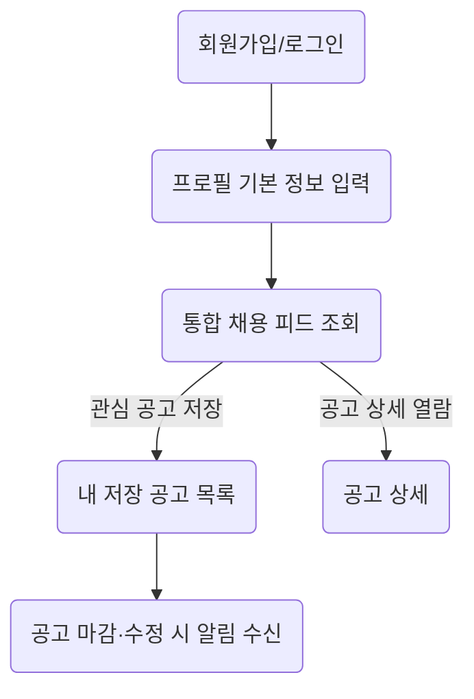

# 📘 제품 요구사항 문서 (PRD)

## 1. 개요

- **제품 이름:** ReBridge
    
- **작성 일자:** 2025-07-12 (rev. MVP-02)
    
- **문서 목적:** 정신장애인 맞춤 구직 정보 통합 플랫폼의 **MVP** 기능‧기술 요구사항을 정의한다. MVP는 “구인 정보 수집·제공”에 집중해 **4주 내 실사용** 가능한 최소 제품을 목표로 한다.
    

---

## 2. 제품 목표 (MVP 관점)

1. **채용 정보 접근성 극대화** – 주요 4개 채널의 공고를 매일 자동 수집‧정규화‧검색 제공.
    
2. **개인화 기반 저장·알림** – 사용자는 관심 공고를 저장하고, 새·마감 공고 알림을 수신한다.
    
3. **단순 스택으로 빠른 출시** – Next.js 14 + PostgreSQL + Redis 3종으로 MVP를 구축, 추후 AI 매칭·워크플로우 등 확장이 가능하도록 모듈형 구조를 확보한다.
    

---

## 3. 주요 기능 (MVP 범위)

|번호|기능명|설명|
|---|---|---|
|3-1|**통합 채용 피드**|워크투게더·고용24·사람인·잡코리아 공고를 최신순·필터별 리스트/상세로 제공|
|3-2|**간단 사용자 프로필**|이메일·비밀번호·장애 등록 여부만 받는 경량 프로필, Saved Jobs·알림 설정 저장|
|3-3|**기본 알림**|저장한 공고 상태 변화(마감‧수정) 및 신규 적합 공고 발생 시 이메일·푸시 전송|

> **Phase 2 이후** – AI 매칭, 심리 체크-인, 상담 예약, 커뮤니티 등 고도화 기능은 차기 단계에서 추가한다.

---

## 4. 사용자 플로우 (MVP)



---

## 5. 기술 요구사항 (MVP)

### 5.1 프로젝트 구조 & 초기 설정

```bash
rebridge/
├── apps/
│   ├── web/                 # Next.js 14 App Router (SSR + API Routes)
│   └── crawler/             # 독립 크롤러 서비스 (Node + Puppeteer)
├── packages/
│   ├── database/            # Prisma 스키마 및 클라이언트
│   ├── shared/              # 공용 타입·유틸
│   └── crawler-adapters/    # 사이트별 크롤러 로직
└── docker-compose.yml       # 로컬 개발용 (PostgreSQL·Redis)
```

- **모노레포**(pnpm workspaces)로 코드·타입 공유.
    
- **CI/CD:** GitHub Actions → Vercel(웹/API) / Upstash Redis / Neon PostgreSQL.
    

---

### 5.2 시스템 아키텍처

```
┌──────────────┐          ┌────────────────┐
│   Next.js    │  GraphQL │  API Layer     │  Prisma ORM
│ (Web+API)    │◀────────▶│  (App Router)  │────────────► PostgreSQL (Neon)
└──────────────┘          └────────────────┘
        ▲                           │
        │                           ▼
        │  WebSocket / REST   ┌──────────────┐
        └─────────────────────►   Redis      │
                                └────────────┘ (TTL 캐시 · Job Queue)
                                    │
                                    ▼
                         ┌──────────────────────┐
                         │  Crawler Manager     │
                         └──────────────────────┘
```

---

### 5.3 크롤링 서브시스템

```typescript
// packages/crawler-adapters/src/base.ts
export interface CrawlerAdapter {
  source: 'workTogether' | 'work24' | 'saramin' | 'jobkorea';
  crawl(page?: number): Promise<RawJobData[]>;
  parseJobDetail(id: string): Promise<JobDetail>;
  normalizeData(raw: RawJobData): NormalizedJob;
}
```

```text
크롤러 매니저
├─ 스케줄러 (node-cron, 매 6 h)
├─ 워커 풀 (Puppeteer, concurrency=4)
│  ├─ WorkTogetherAdapter   { type:'static',  delay:3 s }
│  ├─ Work24Adapter         { type:'dynamic', delay:5 s }
│  ├─ SaraminAdapter        { type:'api',     delay:2 s }
│  └─ JobKoreaAdapter       { type:'dynamic', delay:4 s }
├─ 파서/정규화                (Cheerio + Zod)
└─ DB 저장기                  (Prisma Tx)
```

- **레이트 리밋:** 요청 간격 2-5 초, IP Block 대비.
    
- **재시도:** 최대 3회 + 지수 Backoff(1→2→4 s).
    
- **중복 체크:** `(source, external_id)` 고유 키.
    
- **robots.txt 준수 및 User-Agent 식별**으로 법적·윤리적 이슈 예방.
    

---

### 5.4 데이터베이스 스키마 (핵심 4 테이블)

```sql
CREATE TABLE users (
    id                       UUID PRIMARY KEY,
    email                    VARCHAR(255) UNIQUE NOT NULL,
    password_hash            VARCHAR(255)        NOT NULL,
    is_registered_disability BOOLEAN DEFAULT FALSE,
    created_at               TIMESTAMP DEFAULT NOW()
);

CREATE TABLE jobs (
    id                      UUID PRIMARY KEY,
    source                  VARCHAR(50) NOT NULL,
    external_id             VARCHAR(255) NOT NULL,
    title                   TEXT NOT NULL,
    company                 VARCHAR(255),
    location_json           JSONB,
    salary_range            JSONB,
    employment_type         VARCHAR(50),
    description             TEXT,
    is_disability_friendly  BOOLEAN DEFAULT FALSE,
    crawled_at              TIMESTAMP,
    expires_at              TIMESTAMP,
    raw_data                JSONB,
    search_vector           TSVECTOR,
    UNIQUE (source, external_id)
);

CREATE INDEX jobs_crawled_idx ON jobs (crawled_at DESC);
CREATE INDEX jobs_company_title_idx ON jobs (company, title);
CREATE INDEX jobs_search_idx ON jobs USING GIN(search_vector);

CREATE TABLE user_saved_jobs (
    user_id UUID REFERENCES users(id),
    job_id  UUID REFERENCES jobs(id),
    saved_at TIMESTAMP DEFAULT NOW(),
    PRIMARY KEY(user_id, job_id)
);

CREATE TABLE crawl_logs (
    id UUID PRIMARY KEY,
    source VARCHAR(50),
    status VARCHAR(20),
    jobs_found INT,
    jobs_new INT,
    jobs_updated INT,
    error_message TEXT,
    started_at TIMESTAMP,
    completed_at TIMESTAMP
);
```

#### ➜ 전문 검색 최적화

```sql
CREATE TRIGGER jobs_search_vector_update
BEFORE INSERT OR UPDATE ON jobs
FOR EACH ROW EXECUTE FUNCTION
tsvector_update_trigger(search_vector,
                        'pg_catalog.korean',
                        title, company, description);
```

---

### 5.5 API & 화면 구현 (Next.js 14)

```typescript
// app/jobs/page.tsx  ─ 서버 컴포넌트 (SEO)
export default async function JobsPage({
  searchParams
}: { searchParams: { page?: string; q?: string } }) {
  const page = Number(searchParams.page ?? 1);
  const q = searchParams.q;

  const jobs = await prisma.job.findMany({
    where: q ? {
      OR: [
        { title:   { contains: q, mode: 'insensitive' } },
        { company: { contains: q, mode: 'insensitive' } }
      ]
    } : undefined,
    orderBy: { crawledAt: 'desc' },
    take: 20,
    skip: (page - 1) * 20
  });

  return <JobList jobs={jobs} />;
}
```

- **App Router (Server Components)** 로 SEO, 캐싱(Tags) 최적화.
    
- **NextAuth.js** (Credentials + Kakao OAuth) 로 깔끔한 인증.
    

---

### 5.6 알림 & 캐싱

```typescript
// Redis Pub/Sub Worker (BullMQ)
const notificationWorker = new Worker('notification', async job => {
  const { userId, type, jobId } = job.data;
  const user = await prisma.user.findUnique({ where: { id: userId } });

  if (type === 'jobExpiring') {
    await sendEmail({
      to: user.email,
      subject: '저장한 공고가 곧 마감됩니다',
      html: /* … */
    });
  }
});
```

- **캐싱** – `jobs:latest` 키에 최근 100건 JSON 저장, TTL 1 h
    
- **지속성** – Upstash Redis Durable Streams로 알림 이중화.
    

---

### 5.7 성능 & 모니터링

```typescript
// jobs API with cache
export async function GET() {
  const cached = await redis.get('jobs:latest');
  if (cached) return Response.json(JSON.parse(cached));

  const jobs = await prisma.job.findMany({
    orderBy: { crawledAt: 'desc' },
    take: 100
  });
  await redis.setex('jobs:latest', 3600, JSON.stringify(jobs));
  return Response.json(jobs);
}
```

```typescript
// admin/crawl-status
const logs = await prisma.crawlLog.findMany({
  orderBy: { startedAt: 'desc' },
  take: 50
});
const successRate = logs.filter(l => l.status === 'success').length / logs.length;
```

- **모니터링** – Grafana Cloud 대시보드 + Vercel Analytics.
    
- **Alert** – crawl 실패율 > 20 % or 평균 시간 > 15 min 시 Slack‧메일 알림.
    

---

### 5.8 개발 우선순위 (4 주 계획)

|주차|핵심 산출물|
|---|---|
|**Week 1**|모노레포 세팅, Prisma 스키마, 기본 인증(NextAuth)|
|**Week 2**|WorkTogether·Saramin 크롤러, 데이터 정규화 & 저장 로직|
|**Week 3**|채용 피드 UI/검색/저장, Redis 캐시|
|**Week 4**|고용24·잡코리아 크롤러, 알림 시스템, 배포 & 모니터링|

> **일정은 가이드라인**이며, 캘린더 구체 날짜는 별도 스프린트 보드에서 관리한다.

---

## 6. 기타 / 비고

- **보안:** bcrypt(12) 해시, JWT + Refresh Token, TLS 1.3.
    
- **데이터 윤리:** robots.txt 준수, 원본 사이트 약관 범위 내 데이터 사용, “Right to Be Forgotten” 지원.
    
- **접근성:** WCAG 2.1 AA, 다크모드·키보드 내비게이션·스크린리더 라벨 완비.
    
- **향후 확장:** AI 직무 매칭·워크플로우 보드 등은 독립 **service package** 로 추가, API Gateway에서 GraphQL Federation으로 통합할 수 있도록 도메인 경계 유지.
    

**문서 종료.**